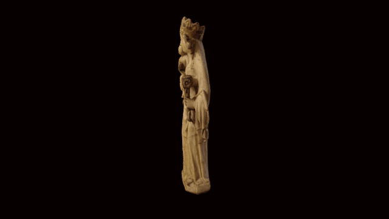

 

# A 3D model of a medieval alabaster figure

All source data to replicate a 3D model of the recently acquired Virgin and Child.

A partially polychromed alabaster representation of the Virgin and Child from England (probably Midlands), about 1350-75. Redemptorist Monastery, Saint Truiden, Limburg, Belgium. Height 75cm

Acquired with the support of the Art Fund, the National Heritage Memorial Fund, The Ruddock Foundation for the Arts, The John Armitage Charitable Trust, Simon Keswick, Wellington and Virginia Sun Yee, the Patrons of the British Museum and Hamish Parker for Genevieve Greenall marking her confirmation.

# License

The contents of this repository are licensed under CC-BY-NC-SA in line with the @britishmuseum licensing policy. 

# Authors

Made by Daniel Pett and Lloyd de Beer, 384 photos from OnePlus 3 mobile phone, assembled in PhotoScan.
